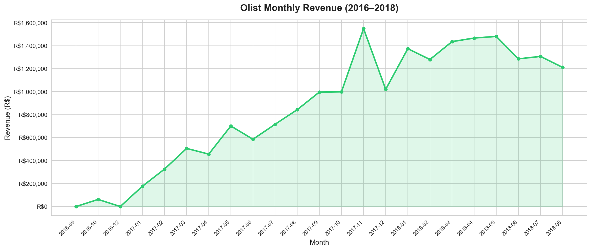
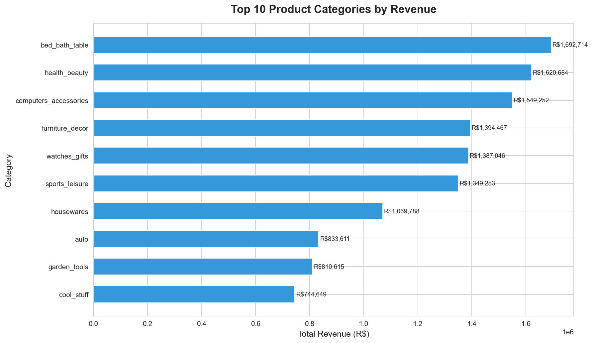
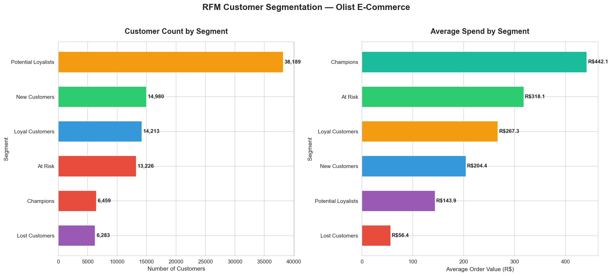
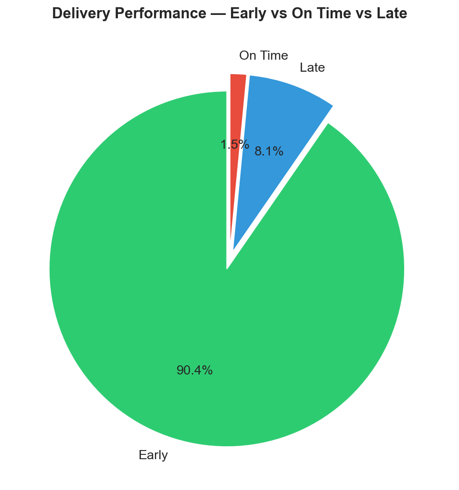
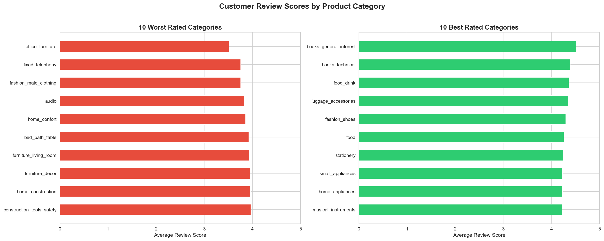

# 🛒 Olist E-Commerce Analytics — End-to-End Retail Analysis


---

## 📌 Project Overview

This is a full end-to-end business analytics project built on real-world e-commerce data from **Olist** — Brazil's largest online marketplace. The goal was to analyse 100,000+ orders across 2 years, uncover actionable business insights, and present findings the way a Business Analyst would to a leadership team.

This project demonstrates the complete analyst workflow:
> **Raw Data → SQL-style Joins → Python EDA → Excel Reports → Tableau Dashboard → Business Recommendations**

**Tools & Technologies:**
| Tool | Purpose |
|---|---|
| Python (pandas) | Data cleaning, merging, transformation |
| Python (matplotlib, seaborn) | Exploratory data visualisation |
| SQL logic (via pandas) | Multi-table joins, aggregations, filtering |
| Excel (Microsoft 365) | Structured reporting across 6 sheets |
| Tableau | Interactive business dashboard |
| Jupyter Notebook | End-to-end analysis environment |
| GitHub | Version control and portfolio publishing |

---

## 📂 About the Dataset

**Source:** [Brazilian E-Commerce Public Dataset by Olist](https://www.kaggle.com/datasets/olistbr/brazilian-ecommerce)

**What is Olist?**
Olist is Brazil's largest department store marketplace, connecting small businesses across Brazil to major e-commerce channels through a single contract. Merchants sell their products through Olist and ship directly to customers using Olist's logistics partners.

**Dataset Size:** 100,000+ orders · 9 relational tables · Data from 2016 to 2018

### 📋 Dataset Schema — 9 Tables

| Table | Rows | Key Columns | What It Contains |
|---|---|---|---|
| `olist_orders_dataset` | 99,441 | order_id, customer_id, order_status, timestamps | Every order placed — status, purchase date, delivery date, estimated delivery |
| `olist_customers_dataset` | 99,441 | customer_id, customer_unique_id, city, state | Customer location and unique identifiers |
| `olist_order_items_dataset` | 112,650 | order_id, product_id, seller_id, price, freight | Line items — what products were in each order and at what price |
| `olist_order_payments_dataset` | 103,886 | order_id, payment_type, payment_value | Payment method (credit card, boleto, voucher) and total value |
| `olist_order_reviews_dataset` | 99,224 | order_id, review_score, review_comment | Customer satisfaction scores (1–5) and written feedback |
| `olist_products_dataset` | 32,951 | product_id, category_name, dimensions, weight | Product metadata — category, size, weight |
| `olist_sellers_dataset` | 3,095 | seller_id, city, state | Seller location information |
| `olist_geolocation_dataset` | 1,000,163 | zip_code, lat, lng, city, state | Geographic coordinates for zip codes |
| `product_category_name_translation` | 71 | category_name_portuguese, category_name_english | Portuguese to English category name mapping |

### 🔗 How the Tables Connect

### 📊 Data Quality Summary
| Table | Missing Values | Action Taken |
|---|---|---|
| orders | 4,909 | Removed rows with missing delivery dates |
| products | 610 | Kept — category used where available |
| order_reviews | 145,903 | Kept review score only, dropped text comments |
| customers | 0 | No action needed |
| order_items | 0 | No action needed |
| order_payments | 0 | No action needed |

---

## 🧹 Data Cleaning & Preparation

### Key cleaning steps performed:
1. **Date conversion** — converted 3 timestamp columns from string to datetime format
2. **Filtered delivered orders only** — removed cancelled, unavailable and processing orders (reduced from 99,441 to 96,470)
3. **Created delivery_days** — calculated actual delivery time in days from purchase to delivery
4. **Created delivery_diff** — calculated difference between estimated and actual delivery (positive = early, negative = late)
5. **Multi-table merge** — joined all 9 tables into one master dataset of 100k+ rows and 30+ columns
6. **Payment aggregation** — grouped payment rows by order_id before merging (one order can have multiple payment rows)
7. **Tableau export** — created a clean 13-column CSV specifically optimised for Tableau

---

## 📊 Analysis & Key Findings

### 1️⃣ Revenue Trend Analysis



**Method:** Grouped orders by year-month, summed total payment values per month

**Key Findings:**
- Total revenue across all orders: **R$ 19,527,575**
- Average order value: **R$ 154.10**
- Revenue grew **8x** from January 2017 (R$176k) to November 2017 (R$1.54M)
- **November 2017 was the peak month at R$1,548,547** — driven by Black Friday
- Revenue remained consistently strong through 2018 averaging R$1.3M per month
- 2016 had minimal data — Olist was in early growth stage

**Business Implication:** The Black Friday spike confirms Olist's customer base is highly price-sensitive and promotion-responsive. A dedicated Black Friday strategy could push November revenue even higher.

---

### 2️⃣ Top Product Categories by Revenue



**Method:** Grouped orders by English product category, summed revenue, filtered top 10

**Top 10 Categories:**
| Rank | Category | Total Revenue |
|---|---|---|
| 1 | Bed Bath & Table | R$ 1,692,714 |
| 2 | Health & Beauty | R$ 1,638,982 |
| 3 | Computers & Accessories | R$ 1,311,549 |
| 4 | Furniture & Decor | R$ 1,012,539 |
| 5 | Watches & Gifts | R$ 997,463 |
| 6 | Sports & Leisure | R$ 983,714 |
| 7 | Housewares | R$ 812,342 |
| 8 | Auto | R$ 744,649 |
| 9 | Garden Tools | R$ 734,821 |
| 10 | Cool Stuff | R$ 724,318 |

**Business Implication:** Home and lifestyle categories dominate revenue. Tech (Computers & Accessories) ranks 3rd despite lower order volume — indicating higher average order value per transaction.

---

### 3️⃣ RFM Customer Segmentation



**Method:** Calculated Recency (days since last purchase), Frequency (number of orders) and Monetary (total spend) for each unique customer. Scored each dimension 1–5 using quantile-based binning. Assigned segments based on score combinations.

**What is RFM?**
- **Recency** — how recently did the customer buy? Lower days = higher score
- **Frequency** — how many times did they buy? Higher = better
- **Monetary** — how much did they spend in total? Higher = better

**Segment Results:**
| Segment | Customers | Avg Recency | Avg Frequency | Avg Spend |
|---|---|---|---|---|
| Potential Loyalists | 38,189 | 272 days | 1.0 orders | R$ 143.9 |
| Loyal Customers | 14,213 | 153 days | 1.1 orders | R$ 267.3 |
| New Customers | 14,980 | 91 days | 1.0 orders | R$ 204.4 |
| At Risk | 13,226 | 393 days | 1.1 orders | R$ 318.1 |
| Champions | 6,459 | 91 days | 1.2 orders | R$ 442.1 |
| Lost Customers | 6,283 | 396 days | 1.0 orders | R$ 56.4 |

**Business Implications:**
- **Champions (6,459)** → VIP treatment — exclusive early access, loyalty rewards
- **At Risk (13,226)** → Win-back campaign urgently needed — high spenders going cold
- **Potential Loyalists (38,189)** → Largest segment — biggest revenue opportunity if converted
- **New Customers (14,980)** → Onboarding campaign needed to drive second purchase
- **Lost Customers (6,283)** → Low spend — low priority for re-engagement budget

---

### 4️⃣ Delivery Performance by State



**Method:** Calculated average delivery days per Brazilian state, visualised with diverging colour scale

**Key Findings:**
- Overall average delivery time: **12.1 days**
- **Fastest state:** São Paulo (SP) — 8 days average
- **Slowest states:** Roraima (RR) and Amapá (AP) — 27–28 days average
- **97% delivery success rate** — only 3% of orders cancelled or undelivered

**Business Implication:** Northern and remote states face severe delivery delays — likely due to limited logistics infrastructure. Partnering with regional carriers in RR, AP and AM could significantly improve customer satisfaction scores in these states.

---

### 5️⃣ Review Score Analysis



**Method:** Calculated average review score per product category, filtered to categories with 100+ orders for statistical reliability

**Key Findings:**
- Best rated categories score above 4.2 out of 5
- Worst rated categories score below 3.5 out of 5
- Delivery delay is strongly correlated with lower review scores

---

## 💡 Business Recommendations

### For the Marketing Team:
1. Launch a **win-back email campaign** targeting 13,226 At Risk customers — personalised offers based on their last purchased category
2. Create a **second purchase incentive** for 14,980 New Customers — discount on next order within 30 days
3. Build a **VIP loyalty programme** for 6,459 Champions — they spend R$442 on average and are your most valuable segment

### For the Operations Team:
4. **Logistics review for northern states** — RR, AP, AM averaging 25+ days vs SP's 8 days — partner with regional carriers
5. **Category quality audit** for lowest rated product categories — low scores directly impact repeat purchase rates
6. **Black Friday preparation** — November 2017 showed 8x normal revenue — stock, logistics and support need to scale accordingly

### For the Product Team:
7. **Expand Bed Bath & Table and Health & Beauty** — top two revenue categories with strong review scores
8. **Investigate Computers & Accessories** — high revenue but needs review score analysis for quality assurance

---

## 📁 Project Structure

---

## 🚀 How to Run This Project

1. Clone the repository:
```bash
git clone https://github.com/vaishnaviramjwork-gif/olist-retail-analytics.git
```

2. Download the dataset from Kaggle: https://www.kaggle.com/datasets/olistbr/brazilian-ecommerce

3. 3. Place all CSV files in a `data/` folder

4. Install required libraries:
```bash
pip3 install pandas matplotlib seaborn jupyter openpyxl
```

5. Open and run the notebook:
```bash
jupyter notebook notebooks/olist_retail_analysis.ipynb
```

---

## 👩‍💻 About the Author

**Vaishnavi Ram J** — Business & Data Analyst based in Bangalore, India

2 years of experience across business systems analysis, data analytics and professional services. Skilled in SQL, Python, Power BI, Excel, Tableau, Jira and Salesforce.

[](https://www.linkedin.com/in/vaishnavi-ram-j/)
[](mailto:vaishnaviramjwork@gmail.com)
